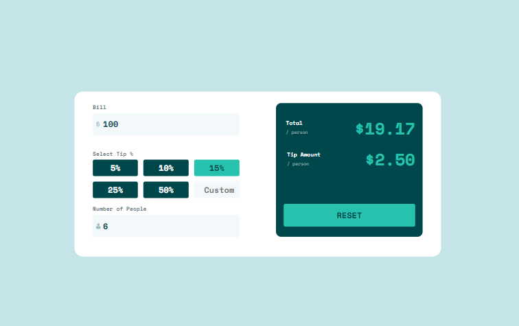

## Table of contents

- [Overview](#overview)
  - [The challenge](#the-challenge)
  - [Screenshot](#screenshot)
  - [Links](#links)
- [My process](#my-process)
  - [Built with](#built-with)
  - [What I learned](#what-i-learned)
- [Author](#author)

## Overview

### The challenge

Users should be able to:

- View the optimal layout for the app depending on their device's screen size
- See hover states for all interactive elements on the page
- Calculate the correct tip and total cost of the bill per person

### Screenshot

### Links

- Solution URL: [GitHub](https://github.com/gabadadzeluca/tip-calculator-app-react)
- Live Site URL: [Live URL](https://gabadadzeluca.github.io/tip-calculator-app-react/)

## My process

### Built with

- CSS Grid
- Mobile-first workflow
- [React](https://reactjs.org/) - JS library

### What I learned
It was my first time using useEffect hook. I also used useState hook, which helped me track actions on the page.

## Author
